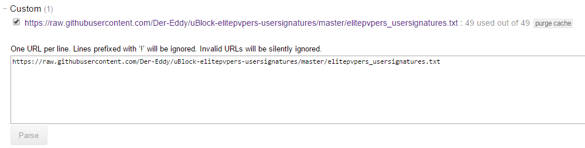
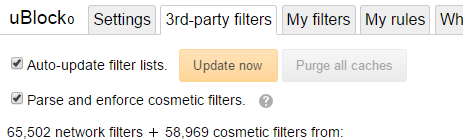

# uBlock-elitepvpers-usersignatures
Blocks advertising in elitepvpers usersignatures for uBlock Origin and AdBlock Plus

Tired of flashy usersignatures? Don't want to see bloated advertising which consumes your bandwidth? Some of them even tracks you. And since you already installed an adblocker, you shouldn't see advertising at all.

Usage
-------------
Add this to your adblocker of choice as a filter list:  
`https://raw.githubusercontent.com/Der-Eddy/uBlock-elitepvpers-usersignatures/master/elitepvpers_usersignatures.txt`  

The list gets updated from time to time, your adblocker will update it then itself.

uBlock Origin
-------------
Detailed usage for uBlock Origin:  
Go to the uBlock Settings via the "3rd party filters" tab and add the link above at the bottom of the site.

Now click on "Parse" and Update now your filter lists

AdBlock Plus
-------------
Detailed usage for AdBlock Plus:  
ToDo