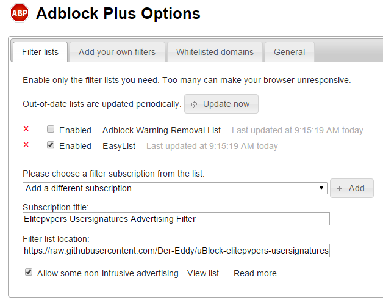

# uBlock Elitepvpers Usersignatures
Blocks advertising in elitepvpers usersignatures for uBlock Origin and AdBlock Plus

Tired of flashy usersignatures? Don't want to see bloated advertising which consumes your bandwidth? Some of them even tracks you. And since you already installed an adblocker, you shouldn't see advertising at all.

Usage
-------------
Add this to your adblocker of choice as a filter list:  
`https://raw.githubusercontent.com/Der-Eddy/uBlock-elitepvpers-usersignatures/master/elitepvpers_usersignatures.txt`  

The list gets updated from time to time, your adblocker will update it then itself.

uBlock Origin
-------------
####Detailed usage for uBlock Origin:  
Go to the uBlock settings via the "3rd party filters" tab and add the link above at the bottom of the site.

Now click on "Parse" and Update now your filter lists.

AdBlock Plus
-------------
####Detailed usage for AdBlock Plus:  
Open then AdBlock Plus options and add a new filter via "Add a different subscription ..."

Insert a filter list title and the link above and click on "Add". Now update your filter and you're done.

License
-------------
  
    The MIT License (MIT)
    
    Copyright (c) 2015 Der-Eddy
    
    Permission is hereby granted, free of charge, to any person obtaining a copy
    of this software and associated documentation files (the "Software"), to deal
    in the Software without restriction, including without limitation the rights
    to use, copy, modify, merge, publish, distribute, sublicense, and/or sell
    copies of the Software, and to permit persons to whom the Software is
    furnished to do so, subject to the following conditions:
    
    The above copyright notice and this permission notice shall be included in all
    copies or substantial portions of the Software.
    
    THE SOFTWARE IS PROVIDED "AS IS", WITHOUT WARRANTY OF ANY KIND, EXPRESS OR
    IMPLIED, INCLUDING BUT NOT LIMITED TO THE WARRANTIES OF MERCHANTABILITY,
    FITNESS FOR A PARTICULAR PURPOSE AND NONINFRINGEMENT. IN NO EVENT SHALL THE
    AUTHORS OR COPYRIGHT HOLDERS BE LIABLE FOR ANY CLAIM, DAMAGES OR OTHER
    LIABILITY, WHETHER IN AN ACTION OF CONTRACT, TORT OR OTHERWISE, ARISING FROM,
    OUT OF OR IN CONNECTION WITH THE SOFTWARE OR THE USE OR OTHER DEALINGS IN THE
    SOFTWARE.